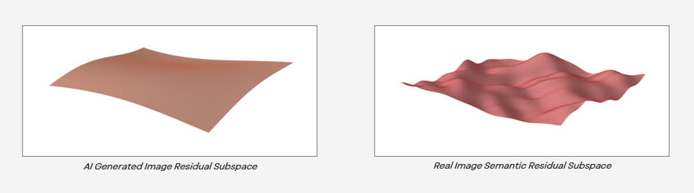
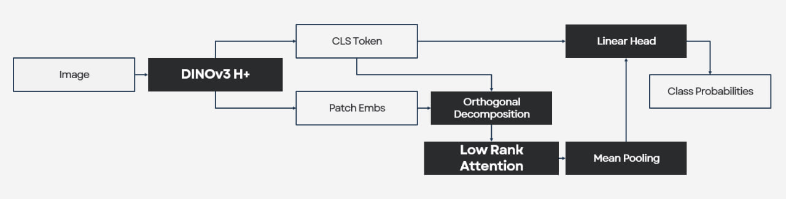

# **Detection with Residuals**
| By: Ian Buxton Sia, Inessa Wong

## **Overview**
The task of AI‑Generated Image (AIGI) detection requires models that are both highly accurate and scalable to large volumes of user-generated content. There exists a multitude of models for this specific task yet none fully overcomes the challenge of robustness under real world transforms. These models rely on features such as frequency domain patterns or pixel level anomalies that degrade under strong transformations.

Our solution consists of an implementation of the model from the paper [LoRC](https://arxiv.org/pdf/2608.20882v1) with a novel Modulated Energy Training (MET) paradigm. Over our curated WildFake evaluation dataset, we achieve a balanced accuracy of **96.57%** and **92.65%** for non-transformed and transformed images respectively.

## **1. Motivation**
In the paper LoRC, they present the idea that AIGI generators exhibit a low rank collapse in the semantic-residual orthogonal subspace. The semantic-residual orthogonal subspace differs greatly from real image to AIGI, whereby real images exhibit larger averaged residual magnitudes. This can be seen in the diagram below where we show a sample of the difference between the subspace of real images and AIGI.



As you can see, the landscape of the AIGI subspace is relatively smoother and this phenomenon is present as a feature in all modern generator families. Furthermore, to showcase its effectiveness as a feature for detection and its robustness to transformations we conduct an experiment that uses a scalar threshold over the mean residual magnitude to segregate real images from AIGI. Without any finetuning of the DINOv3 backbone (training free), we achieve a balanced accuracy of **78.45%** and **75.41%** for non transformed and transformed images respectively. This highlights the effectiveness of this feature for detection and also its robustness against transformations.

## **2. Model Architecture**
We employ the [DINOv3 H+](https://huggingface.co/facebook/dinov3-vith16plus-pretrain-lvd1689m) pretrained backbone for its dense high quality features. As for the model's architecture, we take it from the LoRC paper as seen below.



**2.1. Semantic Residual Orthogonalisation:** Taking the patch embeddings, we decompose them with orthogonalisation into two components, one along the CLS token's global semantic and another as its residual. This decomposition allows us to utilise the semantic residual as a feature and also removes the global semantic information enabling better cross domain generalisation.

**2.2. Low Rank Attention:** As the paper shows that residual discrepancies concentrate in a structured low-dimensional subspace, they make use of low rank attention to ensure that the model focuses exclusively on the dominant low-rank components where the real/fake discrepancy is most pronounced.

**2.3. Linear Classifier:** We use a simple Linear layer for classifying real/fake from the concatenated CLS token and output of the low rank attention for residuals.

## **3. Training**
We employ LoRC's training over the [Dual Data Alignment](https://arxiv.org/pdf/2505.14359) of 144k as specified within the paper however with a novel Modulated Energy Training (MET) mechanism. Our MET mechanism allows our model to generalise better to the residual subspaces not seen in the DDA dataset naturally. MET is an algorithm that applies a random rescale of the residuals, sampled from between 0.5 to 1.5, with the same rescale applied to both real and fake images in a pair.

We found that the main failure modes of the original LoRC training was due to a gap in training data distribution. The test data covered average semantic residual magnitude distributions not seen within training and thus through modulation, the model generalises to more variations and performs better.

## **4. Evaluation**
### **4.1. Results**
We curated a 30k image set of [WildFake](https://huggingface.co/datasets/buxtcodes/WildFake-Sample) that comprises of randomly sampled 750 images for 26 generators across different categories (GAN-based, non-SD Diffusion, SD Diffusion and others). Its composition is of 19,500 fake and 10,500 real images.

Our model achieve a balanced accuracy of **96.57%** and **92.65%** for non-transformed and transformed images respectively. The transformed evaluation uses a uniform sample over each transformation for every image thus each image would have one of the transformations as specified in the transformation list provided.

### **4.2. Limitations**
Pooled across all the images with the same transformations, our model's performance degrades the most with JPEG q=30 and Noise sigma=0.10 at 86.11% and 85.88% balanced accuracy respectively. Furthermore, it generalises to all generator families well apart from DDIM and DDPM of which has 77.33% and 71.07% balanced accuracy over clean images.
 
### **4.3. Throughput**
Over a RTX 3090 Ti (24GB) with 224×224 input, bf16 autocast and `cudnn.benchmark=True`,

| Precision | Best Throughput (batch, peak vRAM) |
|---|---|
| fp32 | 136.6 img/s (batch=160, 4.92GB) |
| bf16 | **143.5 img/s** (batch=192, 3.39GB) |

Showing how our model can scale to real time use cases effectively as required in production environments with heavy load such as TikTok.

## 6. Comparisons with Other Baselines
We have benchmarked three other models, namely [LoRC](https://arxiv.org/pdf/2608.20882v1), [DDA](https://arxiv.org/pdf/2505.14359v6) and [DGS-Net](https://arxiv.org/pdf/2511.13108). We show how mLoRC manages to improve on LoRC and also that it performs significantly better than DDA and DGS-Net. 

| Model | Clean BAcc | Clean AUC | Transformed BAcc | Transformed AUC |
|---|---|---|---|---|
| mLoRC | **96.57%** | **0.9929** | **92.65%** | 0.9723 |
| LoRC | 95.01% | 0.9911 | 91.92% | **0.9739** |
| DDA | 87.31% | 0.9371 | 83.32% | 0.9070 |
| DGS-Net | 64.70% | 0.8140 | 55.80% | 0.6510 |

*Clean represents an evaluation over non transformed images.*

## 7. Future Work
In the future, we plan on expanding our dataset to encompass a larger variety of images rather than just the images from DDA which incorporate only natural images and does not include images of art, screenshots, etc. Additionally, we also plan on iterating more on our MET training paradigm in order to improve it further so as to extract more benefits from it.

## 8. Setup, Installation & Usage

**8.1. Setup and Installation**
```bash
git clone Buxt-Codes/AIGI-mLoRC
cd AIGI-mLoRC
bash setup.sh                 # creates venv/, installs requirements.txt
source venv/bin/activate
```

**8.2. Usage**

**Directory Prediction**
```bash
python predict.py --input_dir <path/to/images> --output results.json
```
`results.json` is a list of `{"image_path": ..., "pred": <float 0-1, P(fake)>}`,
one entry per image found under `<path/to/images>`.

**Downloading & Running WildFake Sample Evaluation**
```bash
python evaluate/download_wildfake_sample.py --out_dir wildfake_eval
python evaluate/evaluate_wildfake.py --data_dir <path/to/wildfake_eval> --out_dir results/wildfake_eval --mode both
```

## 9. Conclusion
This mLoRC implementation demonstrates that robust AIGI detection is possible through taking advantage of the semantic residual subspace. Furthermore, by incorporating a novel training technique, it allows for better generalisation to unseen data distributions.
